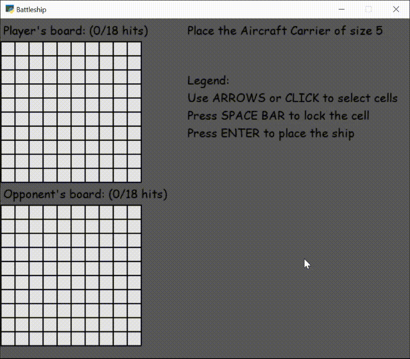

# Battleship

This is my attempt to recreate the famous Battleship game. 
This repository contains a CLI version of the game, as well as a GUI version using the PyGame library.
The logic of the opponent's moves could be further improved, which would enrich the game experience.
Currently, if the opponent hits one of the player's ships, it will try to find the next cell in its environment.
However, once the ship is eliminated, it does not avoid the surrounding cells.

 

  

